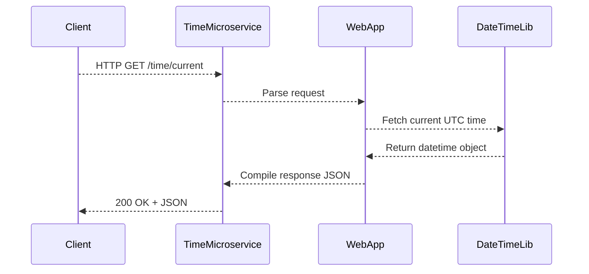

# time-microservice

Microservice for providing current time and date information in the Small Pool project.

## Requesting Data

All requests are **HTTP GET** calls to the microservice running at `http://localhost:3000`.

## Endpoints

- **`/time/current`**

  - Returns the current UTC time.
  - Example:
    ```js
    fetch("http://localhost:3000/time/current")
      .then((res) => res.json())
      .then((data) => console.log(data))
      .catch((err) => console.error(err));
    ```
  - Example Response:
    ```json
    {
      "current_time": "2025-11-17T06:54:13.509090+00:00",
      "formatted_time": "2025-11-17 06:54:13 AM",
      "success": true,
      "timezone": "UTC"
    }
    ```

- **`/time/timezone?timezone=<tz>`**

  - Returns the current time in a specified timezone.
  - Example:
    ```js
    fetch("http://localhost:3000/time/timezone?timezone=America/New_York")
      .then((res) => res.json())
      .then((data) => console.log(data))
      .catch((err) => console.error(err));
    ```
  - Example Response:
    ```json
    {
      "current_time": "2025-11-17T01:54:19.146109-05:00",
      "formatted_time": "2025-11-17 01:54:19 AM EST",
      "success": true
    }
    ```

- **`/time/military`**
  - Returns the current UTC time in 24-hour military format.
  - Example:
    ```js
    fetch("http://localhost:3000/time/military")
      .then((res) => res.json())
      .then((data) => console.log(data))
      .catch((err) => console.error(err));
    ```
  - Example Response:
    ```json
    {
      "format": "24-hour",
      "military_time": "06:54:11",
      "success": true,
      "timezone": "UTC"
    }
    ```

## Error Handling / Response

All responses include a _success_ field that indicates whether or not the operation was successful.
Responses will also have corresponding HTTP status codes to indicate a successful query.
Each error response will also contain an error message.

Example error response:

```json
{
  "error": "Invalid timezone: Invalid/Timezone",
  "success": false
}
```

## UML Diagram



## Running the service

To run the service, first install dependencies:
```bash
pip install Flask pytz requests
````

Next, run the service using the python interpreter:

```bash
python3 time_microservice.py
```

This will launch the microservice on port 3000.

### Contributors

Alexander Kronsup, Ryan Floyd, Rowan Whitmore, Anthony Pham
